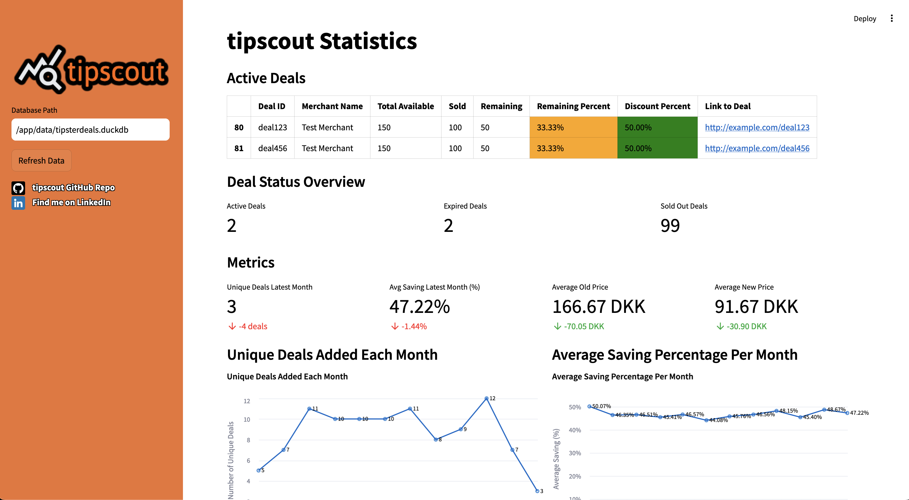

<h1 align="center"></h1>
<h2 align="center"> tipscout: Stats about Tipster deals </h2>

 A data pipeline and visualization app to analyze deals from Tipster.

>[!NOTE]
>This project is very much a Work In Progress. It works, but it's not very useful yet. Hang tight, or better yet, contribute!
>
>**This project is not affiliated with TIPSTER S.M.B.A. ("Tipster") in any way. It's just a fun personal project driven by curiosity 😀**

The tipscout dashboard

## What this does
This project is a data pipeline and visualization app to analyze deals from Tipster. It scrapes the Tipster website for deals, stores the data in a database, and provides a web interface to visualize the data.

In the future... ✨ this might help you make better decisions about which deals to take and which to leave, as well as give useful insights into what deals are available and how much longer they will be available for.

For now, it's a work in progress.

## Tech stack
- Airflow: To schedule the data pipeline and run the Python scripts which scrape the data and store it in the database
- DuckDB: To store the data in an OLAP in-memory database for speedy retrieval
- Streamlit: To create the web interface to visualize the data
- Docker: To containerize the application

## How to use
0. Have Docker & Docker-Compose installed on your machine
1. Clone the repository
2. Run `make init` to set everything up for the first time
3. Go to `http://localhost:8501` to see the visualization app (Streamlit) and `http://localhost:8081` to see the Scheduler (Airflow)

>[!IMPORTANT]
>The app is set up to scrape the website once every 3 hours. You can adjust this in the `airflow/dags/tipster_dag.py` file if you want. Please scrape responsibly 🧡

## To-do list
- [ ] Show in greater detail the deals which are currently available
- [ ] Add more/better visualizations to the Streamlit app
- [ ] Look into the possibility of writing to cloud storage so that the Streamlit app hosted on Streamlit cloud can get up-to-date data (currently not possible as Airflow needs to be run in Docker to scrape the data and update the DB)
